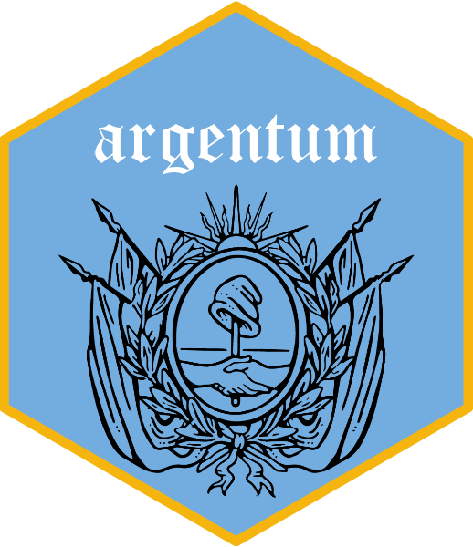

<!-- README.md is generated from README.Rmd. Please edit that file -->

# Argentum 

<!-- badges: start -->
[](https://github.com/thomasartopoulos/argentum/actions/workflows/R-CMD-check.yaml)
[](https://app.codecov.io/gh/thomasartopoulos/argentum)
[](https://lifecycle.r-lib.org/articles/stages.html#stable)
<!-- badges: end -->

> **Datos geoespaciales públicos argentinos, directo a R.**
> **Argentine public geospatial data, straight into R.**

[Español](#español) · [English](#english)

---

## Español

Muchos organismos públicos argentinos —el IGN, catastros provinciales,
municipios, universidades— publican sus capas geográficas a través de dos
estándares abiertos del OGC: **WFS**, que devuelve geometrías y atributos, y
**WMS**, que devuelve una imagen ya dibujada por el servidor.

Están ahí, son gratis, y casi nadie los usa. El problema no es el acceso: es
que cada servidor implementa el estándar a su manera. Uno habla WFS 2.0.0,
otro se quedó en 1.1.0. Uno entiende GeoJSON, otro solo GML. Uno devuelve un
error dentro de un HTTP 200. Uno invierte el orden de los ejes.

`Argentum` absorbe esas diferencias.

### Instalación

```r
# install.packages("pak")
pak::pak("thomasartopoulos/argentum")
```

### Los cinco minutos iniciales

```r
library(Argentum)

# 1. ¿Quién publica qué?
orgs <- argentum_organizations()          # catálogo de IDERA
argentum_search_organizations("catastro")

# 2. ¿Qué capas tiene un organismo?
ign <- "https://wms.ign.gob.ar/geoserver/ows"
capas <- argentum_layers(ign)
head(capas[, c("name", "title")])

# 3. Traer una capa como sf
provincias <- argentum_read_wfs(ign, "ign:provincia")
plot(sf::st_geometry(provincias))
```

### Referencia rápida

Todas las funciones empiezan con `argentum_`: escribí eso en la consola y
apretá `TAB` para verlas todas. Qué hace cada una:

| Función | Qué hace | Devuelve |
|---|---|---|
| `argentum_organizations()` | El catálogo de organismos con geoservicios, según IDERA | data frame |
| `argentum_search_organizations("catastro")` | Busca en ese catálogo por expresión regular | data frame |
| `argentum_layers(org)` | Las capas que publica un organismo o URL | data frame |
| `argentum_capabilities(org)` | El `GetCapabilities` crudo, con la versión ya negociada | objeto imprimible |
| `argentum_read_wfs(org, capa)` | Lee una capa vectorial (geometrías + atributos) | `sf` |
| `argentum_read_wms(org, capa, bbox)` | Pide el mapa ya dibujado por el servidor | `terra::SpatRaster` |
| `argentum_wms_legend(org, capa)` | La leyenda de esa capa WMS | `terra::SpatRaster` |
| `argentum_download(org, dir)` | Baja capas a disco y reporta qué falló | data frame (reporte) |
| `argentum_browse()` | Elegir organismo y capa de forma interactiva | — |
| `argentum_help()` | Guía por temas en la consola, con código para copiar | — |
| `argentum_cache_path()` / `argentum_cache_clear()` | Dónde vive el caché / vaciarlo | ruta / — |

La misma tabla, agrupada y con ejemplos, está en `?argentum` y en la
[referencia del sitio](https://thomasartopoulos.github.io/argentum/reference/).
Las funciones de la 1.x (`argentum_list_organizations()`, etc.) siguen
andando con un aviso; ver `vignette("migrating-to-2-0")`.

### Bajar solo lo que necesitás

Pedir una capa nacional entera para mirar un partido del conurbano es tirar
ancho de banda a la basura —tuyo y del organismo. El filtro viaja al servidor:

```r
argentum_read_wfs(
  ign, "ign:provincia",
  bbox   = c(-59, -35, -57, -34),   # solo este recorte
  crs    = 4326,                    # reproyectado
  filter = "nam = 'Buenos Aires'"   # filtro CQL, del lado del servidor
)
```

Las capas grandes se traen paginadas de forma automática. Si el servidor no
sabe devolver GeoJSON, `Argentum` reintenta en GML sin que tengas que hacer
nada.

### WMS: mapas rasterizados

Novedad de la 2.0. Devuelve un `terra::SpatRaster` georreferenciado, listo
para combinar con datos vectoriales:

```r
base <- argentum_read_wms(
  ign,
  layer = "ign:provincia",
  bbox  = c(-59, -35, -57, -34),
  width = 1000
)

terra::plotRGB(base)
plot(sf::st_geometry(provincias), add = TRUE, border = "white", lwd = 2)
```

### Bajar a disco

```r
reporte <- argentum_download(ign, dir = "datos/ign", format = "gpkg")
subset(reporte, status == "error")   # qué falló y por qué
```

Un error en una capa no aborta la corrida: queda registrado en el reporte y
sigue con la siguiente.

### Configuración

| Opción | Default | Para qué |
|---|---|---|
| `argentum.timeout` | `30` | Segundos por request |
| `argentum.max_tries` | `3` | Reintentos con backoff exponencial |
| `argentum.page_size` | `5000` | Features por página de WFS |
| `argentum.cache_ttl` | `86400` | Vida del caché, en segundos |
| `argentum.catalog` | `NULL` | Ruta a tu propio CSV de endpoints |
| `argentum.quiet` | `FALSE` | Silenciar los mensajes de progreso |

Los servidores públicos son lentos y a veces se caen. `Argentum` cachea el
catálogo y los `GetCapabilities` en disco (`argentum_cache_path()`), así que
volver a correr un script no vuelve a golpear el servidor.

### ¿Venís de la 1.x?

Todo lo de la 1.x sigue funcionando, con un aviso de deprecación (se van en
la 3.0.0):

| 1.x (deprecada) | Usá ahora |
|---|---|
| `argentum_list_organizations()` | `argentum_organizations()` |
| `argentum_list_layers()` | `argentum_layers()` |
| `argentum_get_capabilities()` | `argentum_capabilities()` |
| `argentum_import_wfs_layer()` | `argentum_read_wfs()` |
| `argentum_download_layers()` | `argentum_download()` |
| `argentum_select_organization()` | `argentum_search_organizations()` |
| `argentum_interactive_import()` | `argentum_browse(action = "read")` |
| `argentum_interactive_download()` | `argentum_browse(action = "download")` |

Detalles y diferencias de argumentos: `vignette("migrating-to-2-0")`.

---

## English

Argentine public bodies — the national geographic institute, provincial
cadastres, municipalities, universities — publish their geographic layers
through two open OGC standards: **WFS**, which returns geometries and
attributes, and **WMS**, which returns an image the server has already drawn.

The data is there and it is free. The obstacle is not access, it is that every
server implements the standard slightly differently. One speaks WFS 2.0.0,
another stopped at 1.1.0. One understands GeoJSON, another only GML. One
returns an error inside an HTTP 200. One flips the axis order.

`Argentum` absorbs those differences.

### Installation

```r
# install.packages("pak")
pak::pak("thomasartopoulos/argentum")
```

### First five minutes

```r
library(Argentum)

# 1. Who publishes what?
orgs <- argentum_organizations()          # IDERA's catalogue
argentum_search_organizations("cadastre")

# 2. Which layers does an organization offer?
ign <- "https://wms.ign.gob.ar/geoserver/ows"
layers <- argentum_layers(ign)
head(layers[, c("name", "title")])

# 3. Pull a layer in as sf
provinces <- argentum_read_wfs(ign, "ign:provincia")
plot(sf::st_geometry(provinces))
```

### Quick reference

Every function starts with `argentum_`: type that at the console and press
`TAB` to see them all. What each one does:

| Function | What it does | Returns |
|---|---|---|
| `argentum_organizations()` | The catalogue of publishing organizations, per IDERA | data frame |
| `argentum_search_organizations("cadastre")` | Search that catalogue by regular expression | data frame |
| `argentum_layers(org)` | The layers an organization or URL publishes | data frame |
| `argentum_capabilities(org)` | The raw `GetCapabilities`, version already negotiated | printable object |
| `argentum_read_wfs(org, layer)` | Read a vector layer (geometries + attributes) | `sf` |
| `argentum_read_wms(org, layer, bbox)` | Fetch the map as the server draws it | `terra::SpatRaster` |
| `argentum_wms_legend(org, layer)` | The legend for that WMS layer | `terra::SpatRaster` |
| `argentum_download(org, dir)` | Write layers to disk, reporting what failed | data frame (report) |
| `argentum_browse()` | Pick an organization and layer interactively | — |
| `argentum_help()` | Topic-by-topic console guide, with copy-pasteable code | — |
| `argentum_cache_path()` / `argentum_cache_clear()` | Where the cache lives / empty it | path / — |

The same table, grouped and with examples, lives in `?argentum` and on the
[reference site](https://thomasartopoulos.github.io/argentum/reference/).
The 1.x functions (`argentum_list_organizations()`, etc.) still work with a
warning; see `vignette("migrating-to-2-0")`.

### Fetch only what you need

Downloading a national layer to look at one district wastes bandwidth — yours
and the publisher's. Filters are pushed to the server:

```r
argentum_read_wfs(
  ign, "ign:provincia",
  bbox   = c(-59, -35, -57, -34),   # this window only
  crs    = 4326,                    # reprojected
  filter = "nam = 'Buenos Aires'"   # CQL filter, evaluated server-side
)
```

Large layers are paginated automatically. If the endpoint cannot produce
GeoJSON, the request silently retries as GML.

### WMS: rendered maps

New in 2.0. Returns a georeferenced `terra::SpatRaster` that composes
directly with vector data:

```r
basemap <- argentum_read_wms(
  ign,
  layer = "ign:provincia",
  bbox  = c(-59, -35, -57, -34),
  width = 1000
)

terra::plotRGB(basemap)
plot(sf::st_geometry(provinces), add = TRUE, border = "white", lwd = 2)
```

### Writing to disk

```r
report <- argentum_download(ign, dir = "data/ign", format = "gpkg")
subset(report, status == "error")   # what failed, and why
```

One broken layer does not abort the run; it is recorded and the loop continues.

### Options

| Option | Default | Purpose |
|---|---|---|
| `argentum.timeout` | `30` | Seconds per request |
| `argentum.max_tries` | `3` | Retries, with exponential backoff |
| `argentum.page_size` | `5000` | Features per WFS page |
| `argentum.cache_ttl` | `86400` | Cache lifetime, in seconds |
| `argentum.catalog` | `NULL` | Path to your own endpoint CSV |
| `argentum.quiet` | `FALSE` | Silence progress messages |

Public servers are slow and occasionally down. The catalogue and every
`GetCapabilities` document are cached on disk under `argentum_cache_path()`,
so re-running a script does not hit the server again.

### Coming from 1.x?

Every 1.x function still works, with a deprecation warning (removed in
3.0.0):

| 1.x (deprecated) | Use instead |
|---|---|
| `argentum_list_organizations()` | `argentum_organizations()` |
| `argentum_list_layers()` | `argentum_layers()` |
| `argentum_get_capabilities()` | `argentum_capabilities()` |
| `argentum_import_wfs_layer()` | `argentum_read_wfs()` |
| `argentum_download_layers()` | `argentum_download()` |
| `argentum_select_organization()` | `argentum_search_organizations()` |
| `argentum_interactive_import()` | `argentum_browse(action = "read")` |
| `argentum_interactive_download()` | `argentum_browse(action = "download")` |

Argument-level differences: `vignette("migrating-to-2-0")`.

---

## Citation / Cómo citar

```r
citation("Argentum")
```

## License

MIT © Thomas Artopoulos. The data retrieved through this package remains
subject to the terms of each publishing organization.
